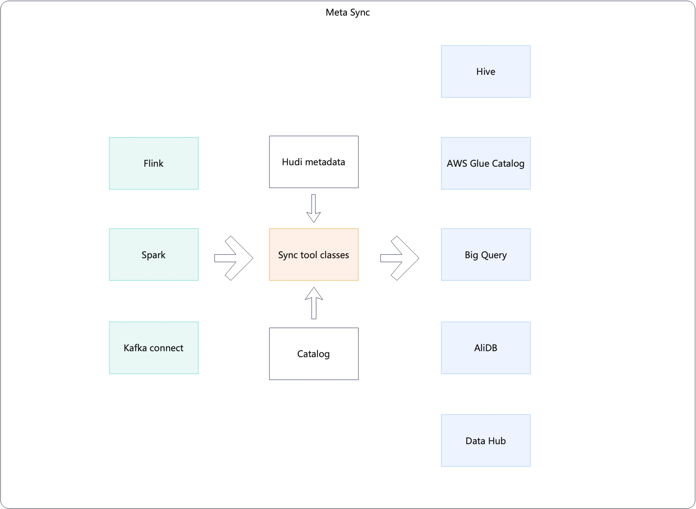

<!--
  Licensed to the Apache Software Foundation (ASF) under one or more
  contributor license agreements.  See the NOTICE file distributed with
  this work for additional information regarding copyright ownership.
  The ASF licenses this file to You under the Apache License, Version 2.0
  (the "License"); you may not use this file except in compliance with
  the License.  You may obtain a copy of the License at

       http://www.apache.org/licenses/LICENSE-2.0

  Unless required by applicable law or agreed to in writing, software
  distributed under the License is distributed on an "AS IS" BASIS,
  WITHOUT WARRANTIES OR CONDITIONS OF ANY KIND, either express or implied.
  See the License for the specific language governing permissions and
  limitations under the License.
-->
# RFC-55: Improve Hive/Meta sync class design and hierachies

## Proposers

- @<proposer1 @fengjian428>
- @<proposer2 @xushiyan>

## Approvers
 - @<approver1 @vinothchandar>
 - @<approver2 @codope>

## Status

JIRA: [HUDI-3730](https://issues.apache.org/jira/browse/HUDI-3730)

## Abstract

Hudi now can sync meta to various Catalogs if user has need, and user can sync meta in different framework such as Spark, Flink, and Kafka connect. 
The current situation is:
* The way to generate Sync configs are inconsistent in different framework;
* what's more, the abstraction of SyncClasses was designed for HiveSync, there are some duplicated code, useless method, parameters and config for new Catalogs, it needs to be improved. 
 
That being said, we need a standard way to call meta sync. We also need a unified abstraction of XXXSyncTool , XXXSyncClient and XXXSyncConfig to handle all supported meta sync, including hms, bigquery, datahub, etc

## Implementation

* for the engines which need use MetaSync, should implement _SupportMetaSync_ on the sync classes, such as DeltaSync, KafkaConnectTransactionServices and etc. for example: `runMetaSync();` then will sync metadata by every SyncToolClasses which indicated in config
* redesign AbstractSyncClient and AbstractSyncTool, add Catalog Interface. make the hierarchy of classes more clearly and more precisely 
* unify the way to generate SyncConfig and the way to call SyncTool，remove some useless parameters

## Rollout/Adoption Plan

 - What impact (if any) will there be on existing users? 
   - No impact, the config changes should be back compatible with the old one if there have
 - If we are changing behavior how will we phase out the older behavior?
 - If we need special migration tools, describe them here.
 - When will we remove the existing behavior

## Test Plan

Describe in few sentences how the RFC will be tested. How will we know that the implementation works as expected? How will we know nothing broke?.